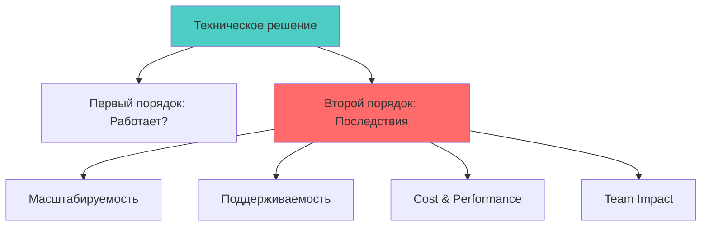
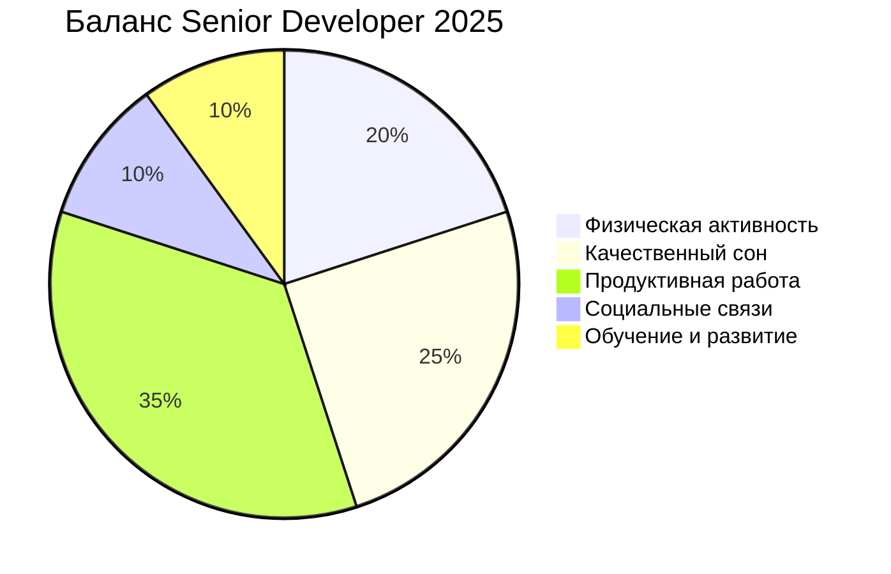

# 🚀 12+ качеств Senior Developer 2025

> **Практическая тетрадь для формирования мировоззрения Senior разработчика в эпоху AI**

---

## 🧠 Technical Mindset

### 1. 🎯 Концентрация — отсекай шум

В 2025 вокруг всё ещё больше отвлекающих факторов: AI-агенты, новые фреймворки, бесконечные туториалы.

**Сила — не в том, чтобы быть везде, а в том, чтобы выбрать направление и держаться курса.**

Лучшие разработчики сегодня — не самые быстрые, а те, кто умеет сказать:
👉 «Эта технология не решает мою задачу» и спокойно продолжить работу.

**Практика:**
- Выбираю 2-3 ключевые технологии на год
- Говорю "НЕТ" модным фреймворкам без четкой цели
- Изучаю глубоко, а не поверхностно

---

### 2. 🔄 Мышление второго порядка

AI-системы ускоряют разработку, но цена ошибки выше.
Решение «сейчас попробуем, потом перепишем» стало слишком дорогим.

**Нужно мыслить на два шага вперёд:**
- Как это решение будет масштабироваться?
- Насколько легко его поддерживать без меня?
- Где оно сломается при росте нагрузки?
- Как модель будет деградировать со временем? (AI-specific)
- Что происходит, когда API third-party падает?

---

### 3. ⚖️ Прагматизм > догма

**«Правильный» подход — не всегда лучший.**

В 2025 выигрывают те, кто умеет балансировать:
- Что автоматизировать AI-агентами, а что руками
- Когда кодить чисто, а когда выпустить MVP
- Где тестировать до боли, а где достаточно smoke-теста
- Использовать микросервисы или монолит для конкретной задачи

**Мантра:** *"Контекст решает, а не best practices"*

---

### 4. 🧭 Основа важнее фреймворков

React, Vue, Next, Bun — всё меняется.
**Но базовые вещи вечные:**
- Алгоритмы и структуры данных
- Сетевые протоколы (HTTP, TCP/IP)
- Базы данных (SQL, индексы, транзакции)
- System design patterns
- Асинхронность и параллелизм

**Кто держит основу, тот оседлывает любой хайп.**

---

### 5. 🧩 Ментальные модели > память

Всё невозможно держать в голове.
Senior разработчики в 2025 не учат детали наизусть — они формируют **модели понимания:**

**Ключевые модели для 2025:**
- 🔄 Как движется поток данных в системе
- ⚡ Где бутылочные горлышки производительности
- 🚨 Какие части системы отвалятся при росте нагрузки
- 🤖 Как работают vector databases и embeddings
- ☁️ Паттерны async processing для AI workloads
- 💰 Cost optimization в облаке

---

## 🚀 Process & Leadership

### 6. 🎪 Ничего никому не доказывать

Senior разработчик в 2025 — это не тот, кто в Slack доказывает ум, а тот, кто **даёт стабильный результат без показухи**.

**Уверенность строится на:**
- ✅ Внутреннем спокойствии и опыте
- ✅ Consistent delivery
- ✅ Quality над quantity
- ❌ НЕ на внешнем одобрении и хайпе

---

### 7. 🚢 Сквозная доставка = ценность

В 2025 мало кто ценит «узких специалистов», которые умеют только фронт или только SQL.

**Ценность — в том, чтобы дотащить задачу от идеи до продакшна:**

**Modern Full-Stack в 2025:**
- Настроить RAG pipeline от embeddings до мониторинга качества
- От локального dev environment до production K8s
- Интеграция с AI/ML сервисами
- Observability и alerting

---

### 8. 🎛️ Контроль процесса

Умение кодить ≠ умение вести процесс.

**В 2025 уважают тех, кто умеет:**
- 💬 Держать дискуссию без эмоций
- 📋 Управлять приоритетами и scope
- 🛑 Говорить «нет» токсичным требованиям
- 💰 Выбивать нормальные условия работы и зарплаты
- 🎯 Направлять техническое направление команды
- 🤝 Менторить и помогать другим расти

**Soft skills стали hard skills в 2025.**

---

## 💪 Sustainability & Growth

### 9. 🔭 Долгий горизонт

AI не убьёт разработку, но убьёт тех, кто мыслит короткими спринтами.

**Senior инженер — это тот, кто инвестирует в навыки на 5–10 лет вперёд:**

**Tech Skills 2025-2035:**
- 🏗️ Platform Engineering (не просто архитектура)
- 🤖 AI/ML Operations и MLOps
- ☁️ Multi-cloud и cost optimization
- 👥 Team leadership в tech командах
- 🔐 Security-first mindset

**Career thinking:** *"Какие навыки будут нужны, когда AI автоматизирует рутину?"*

---

### 10. 🔁 Привычки > знания

Фреймворк умрёт, привычка останется.

**Лучшие привычки 2025:**

| 📝 Daily | 🗓️ Weekly | 🌟 Per Release |
|----------|------------|----------------|
| • Минимальные тесты сразу • Code review без токсичности • Документирую ключевые решения | • Рефлексия по процессам • Изучение 1 нового концепта • Cleanup technical debt | • Post-mortem анализ • Метрики производительности • Team retrospective |

---

### 11. 🏃 Здоровье = главный актив

AI и удалёнка сделали работу ещё более сидячей.

**В 2025 реальный скилл — уметь сохранять тело и психику рабочими:**

**Non-negotiable минимум:**
- 🏋️ Спорт хотя бы 3 раза в неделю
- 😴 Режим сна без хаоса (7-8 часов)
- 📵 Ограничение новостного и соцсетевого мусора
- 🧘 Ментальные перерывы и медитация

**Без этого ни одна карьера не доживёт до «senior-архитектора».**

---

### 12. 💰 Экономическое мышление

**Senior думает не только в коде, но и в деньгах:**

**Key Metrics для 2025:**
- 📊 Стоимость инфраструктуры на пользователя
- ⚡ ROI от автоматизации и оптимизаций
- ⏱️ Time-to-market vs Technical debt balance
- 💸 Cost per request/query в AI системах
- 👥 Стоимость onboarding новых разработчиков

**Вопросы для каждого решения:**
- Сколько это стоит в долгосрочной перспективе?
- Как это влияет на производительность команды?
- Какой business impact от этой оптимизации?

---

### 13. 🔄 Замыкание круга

**Лучшие инженеры 2025 отдают долг:**
- 👨‍🏫 Менторят новичков и мидлов
- 📚 Делятся опытом в командах и комьюнити
- ✍️ Пишут статьи и документацию
- 🎤 Выступают на встречах и конференциях

**Не ради лайков. А ради экосистемы, которая тебя же и поддержит.**

---

## 🎯 Quick Reference Checklist

### 🧠 Technical Excellence
- [ ] Фокусируюсь на 2-3 ключевых технологиях
- [ ] Думаю о последствиях каждого решения
- [ ] Выбираю прагматичный подход над "правильным"
- [ ] Изучаю основы глубже, чем фреймворки
- [ ] Строю ментальные модели систем

### 🚀 Process Leadership
- [ ] Показываю результат, а не активность
- [ ] Могу провести фичу end-to-end
- [ ] Управляю дискуссиями конструктивно
- [ ] Инвестирую в долгосрочные навыки
- [ ] Помогаю расти другим разработчикам

### 💪 Personal Sustainability  
- [ ] Поддерживаю физическое здоровье
- [ ] Формирую полезные ежедневные привычки
- [ ] Думаю в экономических терминах
- [ ] Планирую карьеру на 5+ лет вперед

---

## 💡 Итог

**12+ качеств почти те же, что и 10 лет назад.**

**Но в 2025 акцент сместился:** AI-хаос, выгорание и поток технологий делают ценными **простоту, долгий горизонт и ясность мышления**.

**Senior Developer 2025 = Technical Excellence + Process Leadership + Personal Sustainability**

---

*Версия 1.0 | Обновлено: 2025*
*Следующий review: каждые 6 месяцев*
